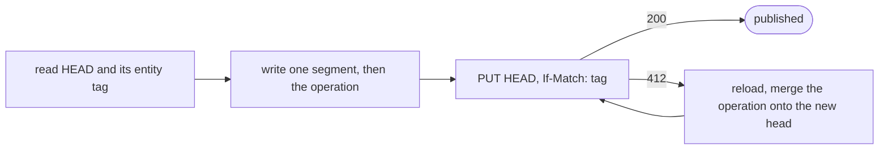
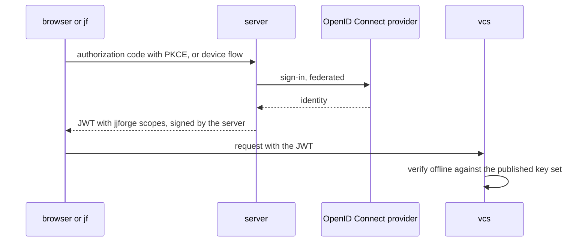

# 0002. Repositories in the object store, the product in Postgres

Status: accepted, 2026-10-05. Deciders: jjforge maintainers.

## Context

A repository holds many immutable objects and one small pointer that changes
often: the operation head. Object stores offer two conditional writes.
`If-None-Match: *` creates an object only if it doesn't exist, and `If-Match`
replaces it only if it hasn't changed. SeaweedFS evaluates both atomically
since 4.29, as do S3, GCS, and R2.

| Option                                   | Cost                                                                            |
| ---------------------------------------- | ------------------------------------------------------------------------------- |
| Repositories on local or shared disks    | A repository is tied to a node                                                  |
| Heads in a database or a consensus group | Every push depends on two stateful systems                                      |
| Whole repositories in the object store   | One round trip per write. Chosen                                                |
| One object pool per organization         | A deleted repository's objects wait for a collector, for forks nobody asked for |

The server's modules need lists, filters, joins, unique names, and a read
that sees the write before it. They must later shard by organization without
a rewrite.

| Option                                                       | Cost                                                                                                   |
| ------------------------------------------------------------ | ------------------------------------------------------------------------------------------------------ |
| Server state as event streams, with Postgres as a read model | A read lags its write, a unique name needs a claim, and apprentices learn event sourcing before Spring |
| Offset pagination, random UUIDs                              | Rows that arrive between pages break the list, and random IDs scatter the index                        |

Apprentices learn Spring Boot, Spring Data, Flyway, and SQL by building the
features in parallel, and one maintainer keeps the Rust code. jjforge must
run on one machine and in a cluster without two code paths.

| Option                                                    | Cost                                                                           |
| --------------------------------------------------------- | ------------------------------------------------------------------------------ |
| vcs offers a storage kernel of streams, names, and leases | Every feature pays for event sourcing, and the Rust maintainer owns a database |
| Microservices from the start                              | Deployment and network failure modes before any module needs them              |
| One binary per role, as Loki, Mimir, and Tempo run        | A flag, a profile, and a chart mode per binary before any role needs to scale  |

People have accounts at their organization's identity provider. Agents and
jobs later act on their behalf with narrower, short-lived access. vcs must
keep serving reads when sign-in is down
([#12](https://github.com/nca-apprentices/jjforge/issues/12)) and authorizes
a push from the token alone.

| Option                                      | Cost                                                                                               |
| ------------------------------------------- | -------------------------------------------------------------------------------------------------- |
| Pass the identity provider's tokens through | No jjforge scopes, so vcs asks the server on every push, and `jf` needs a client at every provider |
| Biscuits instead of JWTs                    | Offline narrowing that no requirement needs yet, and no Spring library issues one                  |

## Decision

### Repositories

The object store holds every repository, so vcs is stateless and any replica
serves any repository. Each repository has its own pool:

```text
t/{org}/r/{repo}/pool/seg/{segment}   packed objects
t/{org}/r/{repo}/pool/idx/{segment}   hash to segment and offset, range reads
t/{org}/r/{repo}/op/{hash}            operations and views
t/{org}/r/{repo}/HEAD                 the current operation
```



- A segment is immutable and has an index, because each request costs time
  and money. The operation names its segments, so a reader finds any object
  from the log alone.
- A new repository creates `HEAD` with `If-None-Match: *`. No write uses any
  other condition, and the bucket has no versioning.
- Nothing is collected. jj keeps every operation, and a deleted repository is
  removed by its prefix. A repository exists in the store before the server
  records it, so an unrecorded `HEAD` is unreachable and costs storage only.

### The server's state

Postgres holds every piece of the server's state: organizations,
repositories, principals, sessions, policy decisions, and whatever later
modules add.

- Each server module owns one schema and migrates it with Flyway. A command
  changes rows and publishes its events in one transaction, so the next read
  sees the write.
- A rule within one module is a constraint, such as a unique index on
  `(org_id, name)`. Work that needs a single owner takes an advisory lock.
- The CloudNativePG operator runs Postgres in the cluster and backs it up to
  the object store, with point-in-time recovery.
- The organization leads every key and index, IDs are UUIDv7, and a
  transaction stays within one tenant. A list answers one page, with an
  opaque `next` cursor while more pages exist. It never answers an offset or
  a total count.

### Boundaries

| Binary | Owns                                                                                                                         | Never                                  |
| ------ | ---------------------------------------------------------------------------------------------------------------------------- | -------------------------------------- |
| vcs    | The jj backend and `sync/v1` of [ADR 0001](0001-native-jj-without-git.md), and `source/v1` for reads from inside the cluster | Anything a person would call a feature |
| server | Organizations, identity, policy, review, landing, hooks, workflows, and notifications, in Postgres                           | Repository storage                     |

- The server is one Spring Boot app, structured with Spring Modulith. Each
  module is a top-level package, owns one Postgres schema, and reads only its
  own tables. `ModulesTest` fails the build on a dependency that crosses a
  module boundary.
- Modules talk through events. A module publishes a Spring Modulith event in
  the transaction that changes its rows, and the event publication registry
  delivers it after the commit and retries it after a crash. No separate
  event bus runs.
- The server learns about pushes through a server-streaming call in
  `source/v1`. It keeps the head it last saw per repository in Postgres and
  reads the operation log from there, so a dropped stream loses nothing.
- Each binary runs every role it has. The chart runs one Deployment of each
  and scales each by replica count. A split by role waits for a measurement
  that asks for it.
- The object store is a URL: `s3://` with the twins, `file://` for vcs on its
  own.
- The infra repository runs SeaweedFS and Postgres in the cluster. The chart
  takes their connection configuration and installs neither.
  `shared/deploy/compose.yaml` runs both binaries with the twins of
  [ADR 0004](0004-specified-tested-built.md).
- No cache service until a requirement needs one, measured. Every replica
  caches immutable objects in memory and on local disk.

### Tokens



- jjforge stores no passwords. Each organization connects its provider.
- jjforge is its own OAuth 2.0 authorization server, built on Spring
  Authorization Server.
- A token that a sub-agent can narrow offline waits for a requirement that
  needs one, and replaces the format without replacing the flows.
- Cedar holds the authorization policy, evaluated in the server. Every
  decision is recorded in Postgres with the policy that made it.
- Revocation takes effect when the current token expires, so tokens are
  short-lived.

## Consequences

- A push costs one conditional request, 20 to 200 ms on most stores, and
  never touches Postgres.
- Losing either store loses data, so both have backups and a restore drill.
- A migration is permanent. A wrong one is fixed by another migration.
- Writes stop at one primary. A module's schema can move to an instance of
  its own when it gets there.
- A query that spans organizations reads from events or a projection.
- When a requirement names a fork, it copies the objects or references the
  segments of its parent. Both change this record.
- A rule that spans modules goes through events, and holds a moment after
  the commit, not in it.
- A module can move into its own service by taking its schema and its events
  with it.
