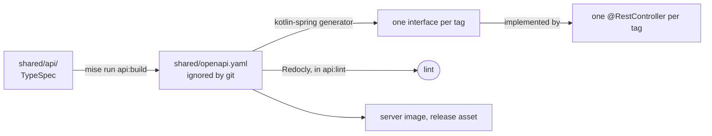
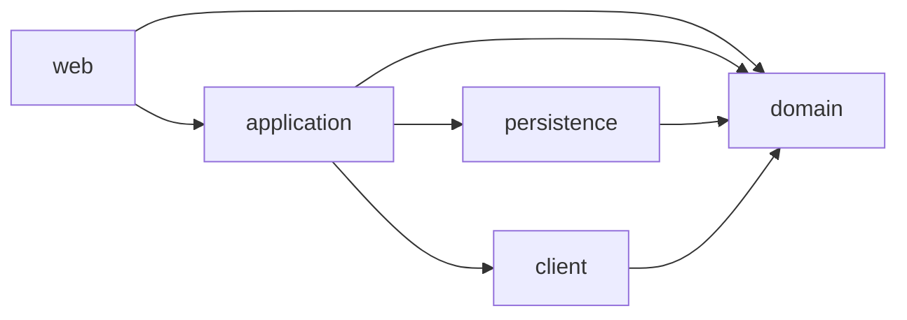
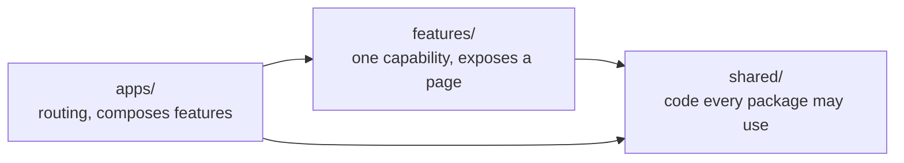

# 0003. Code rules are checked, not reviewed

Status: accepted, 2026-10-05. Deciders: jjforge maintainers.

## Context

Apprentices write most of the code, and a rule that only review holds is
applied unevenly. The server read its one setting with `@Value` and never
validated it, vcs parsed its address by hand, and formatting was the only
rule a tool checked.

| Option                                      | Cost                                                         |
| ------------------------------------------- | ------------------------------------------------------------ |
| Konsist for the server's architecture rules | Reads Kotlin source, and predates Kotlin 2.4                 |
| ArchUnit                                    | Reads compiled classes. Spring Modulith builds on it. Chosen |

The REST contract, written by hand in `shared/openapi.yaml`, repeated every
page schema and error response. An operation that no controller served
answered 404, which looks like a typo, not like work to do.

| Option                                              | Cost                                                                                                                      |
| --------------------------------------------------- | ------------------------------------------------------------------------------------------------------------------------- |
| One YAML contract, or YAML bundled with Redocly     | The repetition stays, and references are checked late                                                                     |
| TypeSpec compiled to OpenAPI                        | One more language and a compile step. A trial compiled with no change oasdiff reports, in 932 lines against 1,298. Chosen |
| Hand-written request mappings                       | A missing operation answers 404                                                                                           |
| Generated interfaces, default methods answering 501 | Chosen while a tag has pending requirements                                                                               |
| Generated abstract interfaces                       | The compiler lists every operation the server doesn't serve. Chosen once a tag is served in full                          |

In the web app, any file imported any other. State kept by hand contradicted
the libraries that own it and was lost when a link was shared
([#48](https://github.com/nca-apprentices/jjforge/issues/48)). An
accessibility fix for WCAG 2.2 AA
([#50](https://github.com/nca-apprentices/jjforge/issues/50)) had no one
place to go.

| Option                                              | Cost                                             |
| --------------------------------------------------- | ------------------------------------------------ |
| Folder conventions                                  | Held only by review                              |
| An Nx workspace with tagged boundaries              | A second build tool to learn                     |
| A pnpm workspace with boundaries in Biome           | Chosen                                           |
| A component library such as Mantine or Primer       | Its internals belong to the library              |
| Tailwind CSS with components in the shadcn/ui style | The project copies them in and owns them. Chosen |

## Decision

Every rule below fails the build. None has a baseline, and none is held by
review.

### The contract

- Nobody edits `shared/openapi.yaml`. Every task that reads it depends on
  `api:build`.
- `mise run api:lint` fails when a `.tsp` file isn't formatted, then lints
  the compiled file with Redocly.
- Operations stay in the `jjforge` namespace, each with its own `@tag` and
  full `@route`, because a nested namespace renames the generated methods. A
  spread of parameters names its namespace, as in `...Parameters.Org`.
- An interface has default methods while its tag has pending requirements,
  and is abstract once the tag is served in full. A default method answers
  501.
- A controller maps no route of its own. `ControllerContractTest` checks
  both directions: a controller maps only contract routes, and every
  generated interface has a controller.
- Kotlin compiles with the `no-compatibility` JVM default mode. The other
  modes copy each default method, with its route, into the controller.

### A server module

Every module of [ADR 0002](0002-state-boundaries-and-tokens.md) has the same
packages. Spring Modulith keeps other modules out of every package but the
top-level one, and `ArchitectureTest` holds each layer to the arrows below.

| Package       | Holds                                                                                                      |
| ------------- | ---------------------------------------------------------------------------------------------------------- |
| `<module>`    | The API: the interfaces, events, and values another module uses, and `ModuleMetadata`. No Spring component |
| `web`         | Controllers of the contract and request filters. Only `web` reads the REST models                          |
| `application` | Services, transactions, and event listeners. It implements the API                                         |
| `domain`      | Entities, values, and rules, with no Spring, Jakarta, SQL, or gRPC type                                    |
| `persistence` | Spring Data repositories and the rows of the module's schema                                               |
| `client`      | gRPC and HTTP clients and their `*Properties`. Only `client` reads the gRPC messages                       |

Every layer may use its module's API and the API of each module that
`ModuleMetadata` allows. The API uses no layer. A layer may hold packages of
its own.

### The server, in `gradle build`

| Rule                                                                                                                                                                                   | Check                           |
| -------------------------------------------------------------------------------------------------------------------------------------------------------------------------------------- | ------------------------------- |
| Settings live in `@Validated` `@ConfigurationProperties` classes named `*Properties`, constrained with Jakarta Validation. Nothing reads `@Value`                                      | `ArchitectureTest`, ArchUnit    |
| A component gets its dependencies through its constructor, never an `@Autowired` or `lateinit` field                                                                                   | `ArchitectureTest`, ArchUnit    |
| A controller serves the contract, as the contract section decides                                                                                                                      | `ControllerContractTest`        |
| A module has the packages of [a server module](#a-server-module), and each layer uses only the layers its arrows allow                                                                 | `ArchitectureTest`, ArchUnit    |
| Another module sees only a module's top-level package                                                                                                                                  | `ModulesTest`, Spring Modulith  |
| A module depends only on the modules that `allowedDependencies` in its `ModuleMetadata` names, and names none until a requirement needs one                                            | `ModulesTest`, Spring Modulith  |
| [Server modules](../modules.md) shows the module graph of the code                                                                                                                     | `ModulesTest`                   |
| Modules talk through events. A listener is an `@ApplicationModuleListener`, never an `@EventListener`                                                                                  | `ArchitectureTest`, ArchUnit    |
| HTTP calls go through `RestClient`, SQL through `JdbcClient` or Spring Data, and time through `java.time`                                                                              | `ArchitectureTest`, ArchUnit    |
| A module's migrations live in `db/migration/<module>` and name only its schema. Every table lives in a module's schema, apart from the event publication registry and Flyway's history | `SchemasTest`, against Postgres |
| Complexity, naming, and likely bugs                                                                                                                                                    | detekt 2                        |
| Formatting                                                                                                                                                                             | ktlint                          |
| No compiler warning                                                                                                                                                                    | the Kotlin compiler             |
| 80 percent line coverage of the hand-written code                                                                                                                                      | Kover                           |

### vcs and `jf`, in `mise run rust:lint`

| Rule                                                                                                                | Check                               |
| ------------------------------------------------------------------------------------------------------------------- | ----------------------------------- |
| Settings come from flags or the environment into one struct. An invalid value stops the binary with a usage message | clap                                |
| No `unwrap` or `expect` outside tests, no `unsafe`, and the `pedantic` group denied                                 | clippy                              |
| No rustdoc warning                                                                                                  | rustdoc                             |
| No unused dependency                                                                                                | cargo-machete                       |
| No disallowed license, security advisory, or unknown source                                                         | cargo-deny                          |
| A crate is a module, and its root declares its API. A module declares its submodules with `mod`, never `pub mod`    | `rg`, outside the generated `proto` |
| An item outside a crate's API is `pub(crate)` or private                                                            | the `unreachable_pub` lint          |
| Only jj-cli and the store crate of ADR 0001 depend on jj-lib                                                        | cargo-deny `wrappers`               |

### The web app, in `mise run web:lint`

`web/` is a pnpm workspace of three kinds of package, each scoped
`@jjforge/*`. The Biome rule `noRestrictedImports` fails the build on an
import outside these arrows, on a parent-relative path out of a package, on
`@tanstack/react-router` in a feature, and on `useState` or `useEffect` in an
app or a feature.

| State        | Owner                                                                         |
| ------------ | ----------------------------------------------------------------------------- |
| Form         | TanStack Form                                                                 |
| Source       | TanStack Query. A read that has to happen again names what changed in its key |
| Address      | TanStack Router, so a shared link reproduces the page                         |
| Presentation | A component in `@jjforge/ui`, each exception named in the Biome rule          |

- Only `@jjforge/api` calls `fetch`. Apps and features use its generated
  client.
- Every dependency version lives in the catalog in `web/pnpm-workspace.yaml`,
  and strict catalog mode makes `pnpm add` write there too. The workspace
  uses pnpm and Biome only.
- A lazy singleton, such as the router, is constructed outside any
  component.
- Only `@jjforge/ui` in `web/shared/ui` renders HTML elements, writes classes
  or styles, imports CSS, or uses Tailwind CSS v4. Two Biome GritQL plugins
  in `web/biome-plugins/` fail the build on an element or a `className` or
  `style` prop outside it.
- The design tokens are CSS variables after shadcn/ui's neutral theme, with
  a dark set for `prefers-color-scheme: dark`. Tailwind scans only
  `web/shared/ui`, and `@jjforge/ui/vite` gives an app the Vite plugin.
- A new look starts as a component in `@jjforge/ui`. Radix primitives and
  the shadcn/ui CLI come in when the first component needs them.

### The repository, in `mise run lint`

actionlint checks the workflows, hadolint the Dockerfiles, and shellcheck the
task scripts.

## Consequences

- OpenAPI 3.1 can't name the event schema of a `text/event-stream` response,
  so `Activity` is reachable only through the description of
  `streamActivity`, until the generators support OpenAPI 3.2.
- The compiled file repeats error responses per operation, marks operations
  without authentication `security: [{}]`, and gives a 204 TypeSpec's default
  description. The generated code doesn't change.
- detekt 2 is an alpha release, because detekt 1.23 can't run on JDK 25. A
  release candidate replaces it once one exists.
