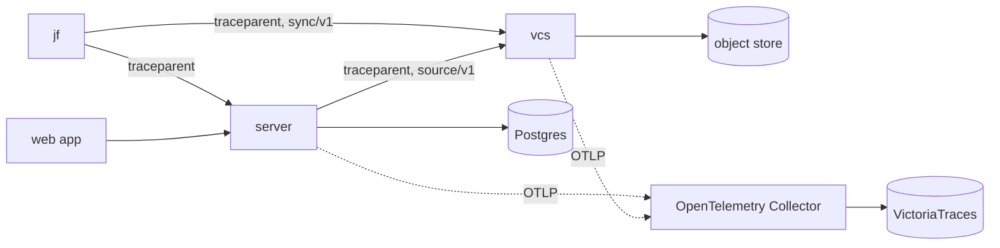

# 0005. Logs, traces, and metrics through OpenTelemetry

Status: proposed, 2026-10-07. Deciders: jjforge maintainers.

## Context

A request crosses `jf` or the browser, the server, vcs, Postgres, and the
object store. When it fails or is slow, the people who run jjforge must find
where, starting from a trace ID that a person quotes. Today the server
exposes Prometheus metrics through Micrometer and vcs through the `metrics`
crate. vcs logs with `println!`, and no binary records a trace.

The infra repository runs VictoriaMetrics with 90 days of metrics,
VictoriaLogs with 30 days of logs collected from container stdout, and
Grafana. It runs no trace store.

- A `VMPodScrape` reads both binaries through the chart's ports named
  `management` and `metrics`. The alert `JjforgeServerErrors` reads
  Micrometer's `http_server_requests_seconds_count`, and `TargetDown` fires
  when a binary stops answering the scrape.
- An app's namespace sends nothing outside itself except DNS queries and
  calls to the API server. The observability namespace admits only itself,
  Traefik, and the API server. A scrape reaches jjforge, and nothing jjforge
  sends reaches a store.

The measurement store in the
[architecture](../architecture.md#building-blocks) measures the software that
people build on jjforge. This record covers telemetry about jjforge itself.

| Option                                                                    | Cost                                                  |
| ------------------------------------------------------------------------- | ----------------------------------------------------- |
| Each language's own tools, Prometheus, and no traces                      | No request can be followed from one binary to another |
| A vendor's agent and backend                                              | Lock-in, and a bill per host                          |
| OpenTelemetry, with OTLP, W3C Trace Context, and the semantic conventions | The Rust trace SDK is beta and still breaks. Chosen   |

| Option for the server                                                                      | Cost                                                                                  |
| ------------------------------------------------------------------------------------------ | ------------------------------------------------------------------------------------- |
| The OpenTelemetry Java agent                                                               | A second instrumentation next to Micrometer, matched by version to Spring, and no AOT |
| `spring-boot-starter-opentelemetry`, which bridges Micrometer Observation to OpenTelemetry | Chosen                                                                                |

| Option for vcs and `jf`                                                                 | Cost                                                                                       |
| --------------------------------------------------------------------------------------- | ------------------------------------------------------------------------------------------ |
| The OpenTelemetry API for spans and `tracing` for events, as opentelemetry-rust advises | tonic emits `tracing` spans, which the export would miss                                   |
| `tracing`, exported through `tracing-opentelemetry`                                     | A bridge outside the OpenTelemetry project, which calls it a workaround at an edge. Chosen |

| Option for logs                                  | Cost                                                                                           |
| ------------------------------------------------ | ---------------------------------------------------------------------------------------------- |
| OTLP from each binary                            | The server needs a third-party Logback bridge, and a crash loses the lines still in the buffer |
| JSON lines on stdout, which the cluster collects | Each binary writes the trace ID into the line itself. Chosen                                   |

| Option for metrics  | Cost                                                                       |
| ------------------- | -------------------------------------------------------------------------- |
| OTLP, pushed        | A network path out of each namespace, new alerts, and no `up` series       |
| Prometheus, scraped | A second transport next to OTLP. Chosen, because the cluster scrapes today |

| Option for the trace store | Cost                                                                          |
| -------------------------- | ----------------------------------------------------------------------------- |
| Grafana Tempo              | A second vendor's stack next to VictoriaMetrics and VictoriaLogs              |
| VictoriaTraces             | Before 1.0, its storage format may change. Chosen, because traces live 7 days |

## Decision

### Signals

| Signal | Answers                                                    | Transport            | Store           | Retention                   |
| ------ | ---------------------------------------------------------- | -------------------- | --------------- | --------------------------- |
| Trace  | Where one request spent its time, and where it failed      | OTLP                 | VictoriaTraces  | 7 days                      |
| Metric | How many, how fast, and how full, over time                | Prometheus, scraped  | VictoriaMetrics | 90 days                     |
| Log    | What a process did that its spans and metrics don't record | JSON lines on stdout | VictoriaLogs    | 30 days                     |
| Audit  | Who did what                                               | A row and its event  | Postgres        | As long as its organization |

- Telemetry is expendable. A fact that must last, such as who changed what,
  is a row in Postgres, as [ADR 0002](0002-state-boundaries-and-tokens.md)
  decides, and never only a log line.
- The infra repository runs the stores, sets their retention, and opens the
  network path to them. The chart installs no store.
- `shared/deploy/compose.yaml` runs VictoriaTraces as the twin of the trace
  store.

### Traces

- The chart passes `OTEL_EXPORTER_OTLP_TRACES_ENDPOINT` to both binaries. A
  binary without it exports nothing and runs as before.
- The endpoint is an OpenTelemetry Collector in the infra repository, which
  every app's namespace reaches. It only receives, because the trace store
  serves reads and deletes on the port that takes writes.
- Each binary sets `service.name` to `jjforge-server` or `jjforge-vcs`, and
  `service.version` to its release. The chart sets
  `deployment.environment.name` through `OTEL_RESOURCE_ATTRIBUTES`.
- Every binary propagates W3C Trace Context and nothing else. Baggage stays
  off, because every binary would forward what a caller sets.
- Each request a binary serves gets a server span. Each call that leaves the
  process gets a client span, whether HTTP, gRPC, SQL, or the object store.
  Spans follow the OpenTelemetry semantic conventions.
- Tracing is cross-cutting, so no endpoint can forget it. The libraries and
  one place per binary trace every request, and the checks below refuse
  tracing code anywhere else.
- The server uses `spring-boot-starter-opentelemetry`, and Spring gRPC traces
  its calls to vcs.
- vcs records spans with `tracing` and exports them through
  `tracing-opentelemetry` and `opentelemetry-otlp`.
  `tonic-tracing-opentelemetry` in `main` continues a trace at every gRPC
  service.
- `jf` exports nothing, because it runs on people's machines. It starts a
  trace per command, and the one client it builds sends `traceparent` with
  every request, so the server and vcs continue the trace of `jf`.
- The web app sends no trace context while the OpenTelemetry browser
  instrumentation is experimental. The server starts the trace.
- The server names the trace of every response in a `traceresponse` header,
  from W3C Trace Context Level 2, whatever answers it. `jf` prints its trace
  ID on failure and the web app shows the header's, so a person can quote it.
- Every binary samples by its parent, and a new trace by the ratio of its
  trace ID, set to 1.0 until the trace store's volume asks for less. When
  it drops, the Collector samples by the whole trace and keeps every error.
- A span names its organization, repository, and principal in
  `jjforge.org.id`, `jjforge.repo.id`, and `jjforge.principal.id`.

### Metrics

- The chart keeps the ports named `management` and `metrics`, which the
  infra scrape selects.
- A metric that a library defines keeps the library's name, because the
  infra alerts read it.
- A metric of jjforge's own takes its name from the semantic conventions
  where they define one, and starts with `jjforge.` otherwise, such as
  `jjforge.push.conflicts`.
- A label takes its values from a set that the code bounds, such as a method
  or a status code. An ID never labels a metric. It goes on the span or the
  log line.

### Logs

- Each binary writes one JSON object per line to stdout, with the text in
  `message`, which the collector reads, and `trace_id` and `span_id` while a
  span is active. The server uses the structured logging of Spring Boot, and
  vcs uses `tracing-subscriber`.
- A message is a constant, and what varies goes in fields, so a search for a
  message finds every line that wrote it.
- A served request writes no line, because its span and its metrics record
  it. A client error writes none either, because the caller made the
  mistake.
- No signal holds a secret, a token, a credential header, a request body,
  repository content, or personal data. A principal appears as its ID.

| Level | When                                                                              |
| ----- | --------------------------------------------------------------------------------- |
| ERROR | A person must act, such as after a server error or lost work                      |
| WARN  | The binary handled something unexpected, such as with a retry                     |
| INFO  | The process starts or stops, or background work finishes                          |
| DEBUG | A diagnosis needs detail. Off where jjforge is deployed, and turned on per logger |

### Checks

| Rule                                                                                 | Check                                    |
| ------------------------------------------------------------------------------------ | ---------------------------------------- |
| The server logs through SLF4J, never through `System.out` or `java.util.logging`     | `ArchitectureTest`, ArchUnit             |
| vcs logs through `tracing`, never through `println!` or `eprintln!`                  | clippy `print_stdout` and `print_stderr` |
| Only the server's `telemetry` module uses a tracing API                              | `ArchitectureTest`, ArchUnit             |
| Every response of the server names its trace                                         | `TraceResponseTest`                      |
| Only `Trace::client` builds an HTTP client in `jf`                                   | clippy `disallowed-methods`              |
| A request that carries `traceparent` has spans of the server and vcs under its trace | `mise run e2e`, which queries the twin   |

## Consequences

- Traces wait for the infra repository. It runs VictoriaTraces and the
  Collector, lets every app's namespace reach the Collector, adds the trace
  store to Grafana, and links `trace_id` in VictoriaLogs to it.
- An upgrade of VictoriaTraces before 1.0 may discard the stored traces,
  which costs at most 7 days of them.
- A caller outside the cluster decides whether its trace is kept. That holds
  while the ratio is 1.0. Lowering it changes this record.
- A SQL client span needs an instrumented data source, chosen with the first
  module that uses Postgres.
- Once the trace SDK of opentelemetry-rust is stable, vcs moves its edges to
  that API and this record changes.
- No check holds the label rule or the rule against secrets yet.
