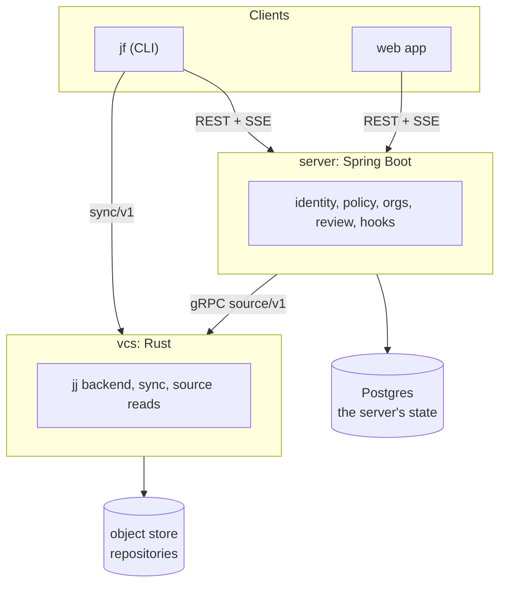

# Architecture

jjforge starts as a forge for Jujutsu repositories and grows into a platform
where people and agents build software with scoped, recorded access. The
decisions behind this page are in [adr/](adr/README.md).

## Components

## Building blocks

| #   | Block                          | What it holds                                                         |
| --- | ------------------------------ | --------------------------------------------------------------------- |
| 1   | Identity and authorization     | Principals, sign-in, tokens, policy, secrets, and the audit log       |
| 2   | Source plane                   | Repositories, changes, the operation log, conflicts, stacks, and sync |
| 3   | Spec and intent plane          | Specs linked to change IDs and traced to measurements                 |
| 4   | Execution plane                | Sandboxes, durable workflows, quotas, and the build cache             |
| 5   | Component registry             | Manifests, install as grant, and supply chain checks                  |
| 6   | Event bus and hooks            | Typed events, blocking gates, and observers                           |
| 7   | Measurement store              | Metrics, traces, and evaluations, keyed by change ID                  |
| 8   | Artifact and attestation store | Content-addressed outputs and the attestations attached to them       |
| 9   | Control plane                  | Organizations, configuration from the forge, tenancy, and metering    |
| 10  | Interfaces                     | The `jf` CLI, the web app, and the public API                         |

## Invariants

1. Every object is addressable by content hash or change ID.
2. Every action is attributable to a principal with a delegation chain.
3. Every capability is a scoped, expiring, identity-bound token.
4. Every state transition emits an event and is recorded.
5. Every component, including the platform's own, uses the same registry,
   permission, and sandbox path.

## Dependency order

Identity and token broker → forge with an operation log event stream → event
bus and hook contract → sandbox runtime → component manifest and registry →
measurement store → spec plane → experimentation and promotion.

Specs and measurements depend on stable change IDs and events. The registry
depends on the permission model. Building the registry before the token model
would force a rewrite of every component. The milestones follow this order.

## Releases and deployment

This repository is the product. The shared cluster in
[nca-apprentices/infra](https://github.com/nca-apprentices/infra) is one
installation of it. The boundary follows these rules:

- The infra repository consumes only what a
  [release](development.md#releasing) publishes. It never references a path in
  this repository.
- A release doesn't deploy. Deploying is a change to `targetRevision` in the
  infra repository's `clusters/<env>/apps/jjforge/application.yaml`.
