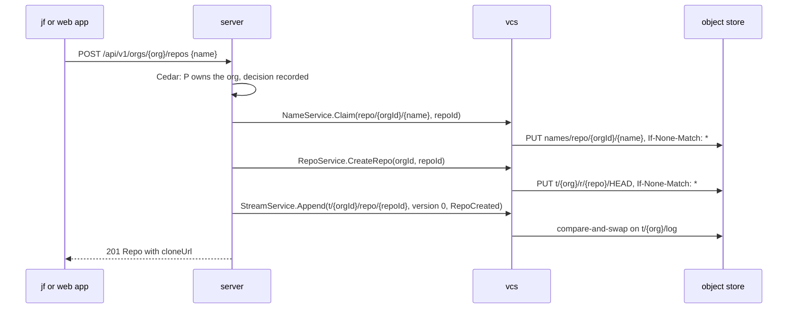
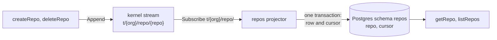

# E10 Orgs and repos

The write paths of [E10](https://github.com/nca-apprentices/jjforge/issues/23).
The server's `repos` module owns the stream prefix `t/{org}/repo/` and the
Postgres schema `repos`, as [ADR 0005](../adr/0005-storage-kernel.md)
decides. The organization sections arrive with their spec PR.

## Create a repository

designs #25 #26 #15

Command: `createRepo(org, name)` by principal P, served by `POST
/api/v1/orgs/{org}/repos`.



1. Policy: P is an owner of the organization, decided by Cedar and recorded,
   as [ADR 0004](../adr/0004-identity-and-tokens.md) decides. Refused: 403
   `forbidden`.
2. Name: `NameService.Claim("repo/{orgId}/{name}", owner = repoId)`, with a
   new UUIDv7 as the repository ID. `ALREADY_EXISTS`: 409 `name_taken`. The
   claim is global, so the same name in another organization is a different
   name.
3. Storage: `RepoService.CreateRepo(orgId, repoId)`. vcs writes
   `t/{org}/r/{repo}/HEAD` at the root operation with `If-None-Match: *`,
   as [ADR 0006](../adr/0006-object-store-is-the-source-of-truth.md) decides.
   This step runs in the command, not in a projector, because the acceptance
   says the repository can be cloned right away.
4. Stream: append `repos.v1.RepoCreated` to `t/{orgId}/repo/{repoId}` with
   expected version 0. The schema is in
   [proto/repos/v1](../../proto/repos/v1/). The principal comes from the
   token, in `Event.principal_id`, never from the event body.
5. Answer 201 from the command's own values, with the clone address
   `https://{host}/sync/v1/{orgId}/{repoId}`. Nothing waits on the read
   model.

Partial failures:

- A crash after step 2 leaves a claimed name with no stream. The sweeper that
  holds the lease `repos/sweeper` releases a claim whose owner has no
  `RepoCreated` after ten minutes.
- A crash after step 3 leaves a `HEAD` with no event. The same sweeper
  deletes it.
- Steps 3 and 4 are idempotent for one repository ID, so the server may
  retry them.

## Delete a repository

designs #28 #15

Command: `deleteRepo(org, repo)` by principal P, served by `DELETE
/api/v1/orgs/{org}/repos/{repo}`.

1. Policy: P is an owner of the organization. Refused: 403 `forbidden`. A
   principal outside the organization gets 404 `not_found`, as every read
   does.
2. Stream: append `repos.v1.RepoDeleted` with the version the command read.
   A stream that moved answers `ABORTED`, and the command reloads and tries
   again. A repository that is already deleted answers 404.
3. Storage: `RepoService.DeleteRepo(orgId, repoId)` removes everything under
   `t/{org}/r/{repo}/`. Objects in the organization's pool that nothing
   references any more are collected by the background job of ADR 0006.
4. Name: `NameService.ReleaseName("repo/{orgId}/{name}", owner = repoId)`,
   so the name is free for a new repository.
5. Answer 204.

The event comes first, so a crash after step 2 leaves a deleted repository
whose storage and name the sweeper cleans up. A crash before it leaves
nothing.

## Read model

designs #27

Schema `repos`, written only by the projector:



```text
repo(org_id, id, name, clone_url, created_at)   primary key (org_id, id)
                                                 unique (org_id, name)
cursor(projector, position)
```

The projector applies `RepoCreated` as an insert and `RepoDeleted` as a
delete, and writes its cursor in the same transaction, as
[ADR 0008](../adr/0008-postgres-holds-read-models.md) decides.

`getRepo` and `listRepos` read it. `listRepos` orders by `(org_id, id)`, so
the list is in creation order, and the `next` cursor encodes the last ID.
The policy decides visibility per request, and a denied read answers 404
`not_found`, never 403, so an outsider learns nothing from the answer.
