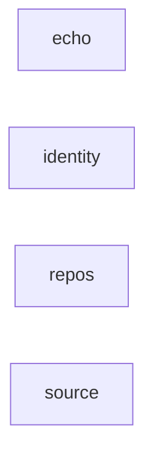

# Server modules

The modules of the server, as `ModulesTest` reads them from the code. An
arrow points from a module to a module it depends on. Each module's
`ModuleMetadata` allows its dependencies, and `ModulesTest` rewrites this page
when they change.

