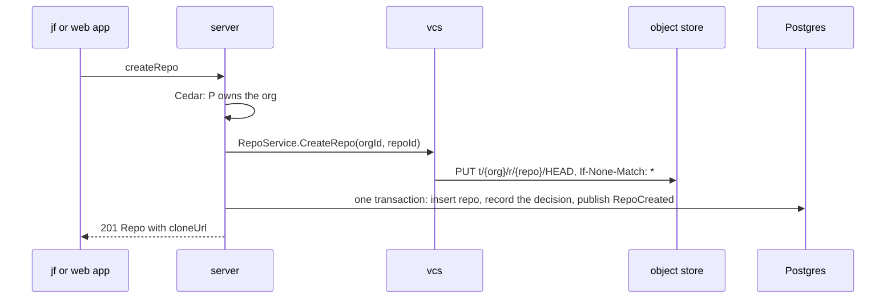

# Orgs and repos

The repositories of [#23](https://github.com/nca-apprentices/jjforge/issues/23).
The server's `repos` module owns the Postgres schema `repos`, as
[ADR 0002](../adr/0002-state-boundaries-and-tokens.md) decides. The organization
requirement, [#24](https://github.com/nca-apprentices/jjforge/issues/24),
gets its section in its own spec PR.

The scenarios use the seed that `mise run up` loads once
[#6](https://github.com/nca-apprentices/jjforge/issues/6) and
[#13](https://github.com/nca-apprentices/jjforge/issues/13) are built: an owner and a member of the organization `acme`, and an owner of
`other`, as [ADR 0004](../adr/0004-specified-tested-built.md) decides.

## Create a repository (#25)

[#25](https://github.com/nca-apprentices/jjforge/issues/25) states the
requirement.

| ID   | Functional requirement                                                                                                               |
| ---- | ------------------------------------------------------------------------------------------------------------------------------------ |
| 25.1 | `createRepo` by an owner answers 201 with the `Repo`, whose `cloneUrl` is `https://{host}/sync/v1/{orgId}/{repoId}`.                 |
| 25.2 | vcs writes the repository's `HEAD` at the root operation before the server answers, so `GET {cloneUrl}/head` answers 200 at once.    |
| 25.3 | A member of the organization reads the new repository with `getRepo`.                                                                |
| 25.4 | A member who isn't an owner gets 403 `forbidden`, as [#15](https://github.com/nca-apprentices/jjforge/issues/15) decides.            |

- Operations: `createRepo`, `getRepo`, `RepoService.CreateRepo`, and
  `GET {cloneUrl}/head`.
- Types: `RepoCreate`, `Repo`, `Problem`, `source.v1.CreateRepoRequest`,
  and the `repos` module's `RepoCommands` and `RepoCreated`.
- Flow: [create a repository](#create-a-repository).

Scenario: [25-repo-create.hurl](../../e2e/http/25-repo-create.hurl).

## A repository name is unique within its organization (#26)

[#26](https://github.com/nca-apprentices/jjforge/issues/26) states the
requirement.

| ID   | Functional requirement                                                                                                  |
| ---- | ----------------------------------------------------------------------------------------------------------------------- |
| 26.1 | `createRepo` with a name the organization already holds answers 409 `name_taken` and inserts no row.                    |
| 26.2 | `createRepo` with a name another organization holds answers 201.                                                        |
| 26.3 | The unique index on `(org_id, name)` decides, so two creates of one name at once answer one 201 and one 409.            |

- Operations: `createRepo`.
- Types: `RepoCreate`, `Problem`, and the `repos.repo` table.
- Flow: [create a repository](#create-a-repository), step 3.

Scenario: [26-repo-name-unique.hurl](../../e2e/http/26-repo-name-unique.hurl).

## A person sees only the organizations and repositories they belong to (#27)

[#27](https://github.com/nca-apprentices/jjforge/issues/27) states the
requirement.

| ID   | Functional requirement                                                                                                            |
| ---- | --------------------------------------------------------------------------------------------------------------------------------- |
| 27.1 | `getOrg`, `listRepos`, and `getRepo` by a principal outside the organization answer 404 `not_found`, never 403.                   |
| 27.2 | `listOrgs` answers only the organizations the principal belongs to.                                                               |
| 27.3 | `listRepos` by a member answers the organization's repositories in creation order, one page at a time, with an opaque `next`.     |

- Operations: `listOrgs`, `getOrg`, `listRepos`, and `getRepo`.
- Types: `OrgPage`, `Org`, `RepoPage`, `Repo`, `Problem`, and the `repos`
  module's `RepoQueries`.
- Flow: the [Persistence](#persistence) section gives the queries.

Scenario: [27-repo-visibility.hurl](../../e2e/http/27-repo-visibility.hurl).

## Delete a repository (#28)

[#28](https://github.com/nca-apprentices/jjforge/issues/28) states the
requirement.

| ID   | Functional requirement                                                                                                           |
| ---- | -------------------------------------------------------------------------------------------------------------------------------- |
| 28.1 | `deleteRepo` by an owner answers 204, after one transaction deletes the row and publishes `RepoDeleted`.                         |
| 28.2 | Afterwards `getRepo` answers 404 `not_found`, and `createRepo` with the same name answers 201.                                   |
| 28.3 | A second `deleteRepo` answers 404 `not_found`.                                                                                   |
| 28.4 | A member who isn't an owner gets 403 `forbidden`, as [#15](https://github.com/nca-apprentices/jjforge/issues/15) decides.        |
| 28.5 | The listener of `RepoDeleted` removes everything under `t/{org}/r/{repo}/` through `RepoService.DeleteRepo`, retried until done. |

- Operations: `deleteRepo`, `getRepo`, `createRepo`, and
  `RepoService.DeleteRepo`.
- Types: `Problem`, `source.v1.DeleteRepoRequest`, and the `repos` module's
  `RepoCommands`, `RepoDeleted`, and `RepoStorageListener`.
- Flow: [delete a repository](#delete-a-repository).

Scenario: [28-repo-delete.hurl](../../e2e/http/28-repo-delete.hurl).

## Flow

### Create a repository

Operation `createRepo` by principal P.



1. Policy: P is an owner of the organization, decided by Cedar, as
   [ADR 0002](../adr/0002-state-boundaries-and-tokens.md) decides. Refused: 403
   `forbidden`.
2. Storage: `RepoService.CreateRepo(orgId, repoId)`, with a new UUIDv7 as
   the repository ID. vcs writes `t/{org}/r/{repo}/HEAD` at the root
   operation with `If-None-Match: *`, as
   [ADR 0002](../adr/0002-state-boundaries-and-tokens.md) decides.
   The storage comes first, so a recorded repository can always be cloned.
3. Row: insert into `repos.repo` and record the policy decision, in one
   transaction that also publishes the `RepoCreated` event. The unique index
   on `(org_id, name)` refuses a taken name: 409 `name_taken`.
4. Answer 201 with the clone address
   `https://{host}/sync/v1/{orgId}/{repoId}`.

### Delete a repository

Operation `deleteRepo` by principal P.

1. Policy: P is an owner of the organization. Refused: 403 `forbidden`. A
   principal outside the organization gets 404 `not_found`, as every read
   does.
2. Row: delete from `repos.repo` and record the decision, in one transaction
   that also publishes the `RepoDeleted` event. A row that is already gone
   answers 404. From here the repository is invisible, and its name is free.
3. Answer 204.
4. Storage: the listener for `RepoDeleted` calls
   `RepoService.DeleteRepo(orgId, repoId)`, which removes everything under
   `t/{org}/r/{repo}/`. It runs after the commit, and the event publication
   registry retries it until it completes.

## Persistence

The object store holds the repository at `t/{org}/r/{repo}/`, starting with
its `HEAD`. The server holds the Postgres schema `repos`:

```text
repo(org_id, id, name, created_at)   primary key (org_id, id)
                                     unique (org_id, name)
```

The clone address is derived from the host and the IDs, not stored. The
events `RepoCreated` and `RepoDeleted` are Spring Modulith events of the
`repos` module, and the event publication registry keeps them in its own
table until every listener completes, as
[ADR 0002](../adr/0002-state-boundaries-and-tokens.md) decides.

`getRepo` and `listRepos` read `repo`. `listRepos` orders by `(org_id, id)`,
so the list is in creation order, and the `next` cursor encodes the last ID.
The policy decides visibility per request, and a denied read answers 404
`not_found`, never 403.

## Architecture

The paths cross two server modules and vcs. A module exposes only its
top-level package, as [ADR 0002](../adr/0002-state-boundaries-and-tokens.md)
decides.

| Module or crate | Item                         | Kind                   | Role                                                                                                                                             |
| --------------- | ---------------------------- | ---------------------- | ------------------------------------------------------------------------------------------------------------------------------------------------ |
| `repos`         | `ReposController`            | class                  | Overrides the generated `ReposApi` methods, as [ADR 0003](../adr/0003-checked-code-rules.md) decides, and calls `RepoCommands` or `RepoQueries`. |
| `repos`         | `RepoCommands`               | service                | `create` and `delete`: the policy, the storage, the row, and the event, in the order the Flow section gives.                                     |
| `repos`         | `RepoQueries`                | service                | `get` and `list`, with the cursor of the Persistence section.                                                                                    |
| `repos`         | `RepoRepository`             | Spring Data repository | The rows of `repos.repo`.                                                                                                                        |
| `repos`         | `RepoStorage`                | class                  | The gRPC client of `RepoService` in vcs.                                                                                                         |
| `repos`         | `RepoCreated`, `RepoDeleted` | event                  | Published in the transaction that changes the row.                                                                                               |
| `repos`         | `RepoStorageListener`        | class                  | Calls `RepoStorage.delete` for each `RepoDeleted`.                                                                                               |
| `identity`      | `Policy`                     | service                | Decides with Cedar and records each decision.                                                                                                    |
| vcs             | `source`                     | module                 | `RepoService.CreateRepo` and `DeleteRepo`, on the store crate's `Repo::create` and `Repo::delete`.                                               |

External systems and their twins in `shared/deploy/compose.yaml`: Postgres
as `postgres`, the object store as `seaweedfs`, and the identity provider
that signs the scenarios' people in as `oidc`.

## Failures

A crash after the `HEAD` is written and before the row is inserted leaves a
`HEAD` under an ID that nothing records. Nobody can address it, and it costs
storage only. Nothing repairs it.

A crash after the delete transaction and before the storage is removed
leaves the `RepoDeleted` publication incomplete. The event publication
registry resubmits it on the next start, and `DeleteRepo` is idempotent, so
the storage goes away.

## Tests

- An integration test against the `postgres` twin creates one name from two
  threads at once and gets one row, as 26.3 requires.
- An integration test deletes a repository, stops the server before the
  listener runs, restarts it, and finds the prefix gone, as 28.5 requires.
