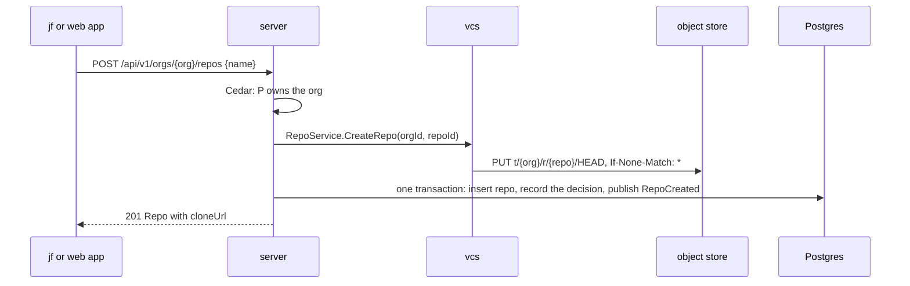

# Orgs and repos

The repositories of [#23](https://github.com/nca-apprentices/jjforge/issues/23).
The server's `repos` module owns the Postgres schema `repos`, as
[ADR 0004](../adr/0004-vcs-and-server.md) decides. The organization
requirement, [#24](https://github.com/nca-apprentices/jjforge/issues/24),
gets its section in its own spec PR.

The scenarios use the seed that `mise run up` loads once
[#6](https://github.com/nca-apprentices/jjforge/issues/6) and
[#13](https://github.com/nca-apprentices/jjforge/issues/13) are built: an owner and a member of the organization `acme`, and an owner of
`other`, as [ADR 0009](../adr/0009-specified-tested-built.md) decides.

## Create a repository (#25)

An owner adds an empty repository to their organization, and members use it at
once. The answer carries the clone address
`https://{host}/sync/v1/{orgId}/{repoId}`, and a clone works as soon as the
answer arrives. A member's attempt is refused with 403
`forbidden`, as [#15](https://github.com/nca-apprentices/jjforge/issues/15)
decides. Operation `createRepo`, command `jf repo create`, and the New
repository screen.

Scenario: [repo-create.hurl](../../e2e/http/pending/repo-create.hurl).

## A repository name is unique within its organization (#26)

Two repositories in one organization never share a name. A second one with the
same name is refused with 409 `name_taken`. The same name in another
organization is a different name and succeeds. Part of `createRepo`.

Scenario: [repo-name-unique.hurl](../../e2e/http/pending/repo-name-unique.hurl).

## A person sees only the organizations and repositories they belong to (#27)

Lists show only the person's organizations and their repositories. An
organization or a repository the person doesn't belong to answers 404
`not_found`, never 403, so an outsider learns nothing from the answer.
Operations: `listOrgs`, `getOrg`, `listRepos`, `getRepo`.

Scenario: [repo-visibility.hurl](../../e2e/http/pending/repo-visibility.hurl).

## Delete a repository (#28)

An owner removes a repository and everything in it. Afterwards it can't be
read, cloned, or pushed to, and its name is free for a new repository. A
member's attempt is refused with 403 `forbidden`, as
[#15](https://github.com/nca-apprentices/jjforge/issues/15) decides.
Operation: `deleteRepo`. Command: `jf repo delete`.

Scenario: [repo-delete.hurl](../../e2e/http/pending/repo-delete.hurl).

## Flow

### Create a repository

Command `createRepo(org, name)` by principal P, served by `POST
/api/v1/orgs/{org}/repos`.



1. Policy: P is an owner of the organization, decided by Cedar, as
   [ADR 0005](../adr/0005-identity-and-tokens.md) decides. Refused: 403
   `forbidden`.
2. Storage: `RepoService.CreateRepo(orgId, repoId)`, with a new UUIDv7 as
   the repository ID. vcs writes `t/{org}/r/{repo}/HEAD` at the root
   operation with `If-None-Match: *`, as
   [ADR 0003](../adr/0003-where-state-lives.md) decides.
   The storage comes first, so a recorded repository can always be cloned.
3. Row: insert into `repos.repo` and record the policy decision, in one
   transaction that also publishes the `RepoCreated` event. The unique index
   on `(org_id, name)` refuses a taken name: 409 `name_taken`.
4. Answer 201 with the clone address
   `https://{host}/sync/v1/{orgId}/{repoId}`.

### Delete a repository

Command `deleteRepo(org, repo)` by principal P, served by `DELETE
/api/v1/orgs/{org}/repos/{repo}`.

1. Policy: P is an owner of the organization. Refused: 403 `forbidden`. A
   principal outside the organization gets 404 `not_found`, as every read
   does.
2. Row: delete from `repos.repo` and record the decision, in one transaction
   that also publishes the `RepoDeleted` event. A row that is already gone
   answers 404. From here the repository is invisible, and its name is free.
3. Answer 204.
4. Storage: the listener for `RepoDeleted` calls
   `RepoService.DeleteRepo(orgId, repoId)`, which removes everything under
   `t/{org}/r/{repo}/`. It runs after the commit, and the event publication
   registry retries it until it completes.

## Persistence

The object store holds the repository at `t/{org}/r/{repo}/`, starting with
its `HEAD`. The server holds the Postgres schema `repos`:

```text
repo(org_id, id, name, created_at)   primary key (org_id, id)
                                     unique (org_id, name)
```

The clone address is derived from the host and the IDs, not stored. The
events `RepoCreated` and `RepoDeleted` are Spring Modulith events of the
`repos` module, and the event publication registry keeps them in its own
table until every listener completes, as
[ADR 0004](../adr/0004-vcs-and-server.md) decides.

`getRepo` and `listRepos` read `repo`. `listRepos` orders by `(org_id, id)`,
so the list is in creation order, and the `next` cursor encodes the last ID.
The policy decides visibility per request, and a denied read answers 404
`not_found`, never 403.

## Architecture

- The server's `repos` module: the controller that overrides the generated
  methods, as [ADR 0006](../adr/0006-contract-in-typespec.md)
  decides, the commands, the queries, and the `RepoDeleted` listener.
- vcs, over gRPC: `RepoService` in `source/v1` for the repository's storage,
  as [ADR 0004](../adr/0004-vcs-and-server.md) decides.
- Cedar in the server decides the policy and records each decision, as
  [ADR 0005](../adr/0005-identity-and-tokens.md) decides.
- External systems and their twins in `shared/deploy/compose.yaml`: Postgres
  as `postgres`, the object store as `seaweedfs`, and the identity provider
  that signs the scenarios' people in as `oidc`.

## Failures

A crash after the `HEAD` is written and before the row is inserted leaves a
`HEAD` under an ID that nothing records. Nobody can address it, and it costs
storage only. Nothing repairs it.

A crash after the delete transaction and before the storage is removed
leaves the `RepoDeleted` publication incomplete. The event publication
registry resubmits it on the next start, and `DeleteRepo` is idempotent, so
the storage goes away.
