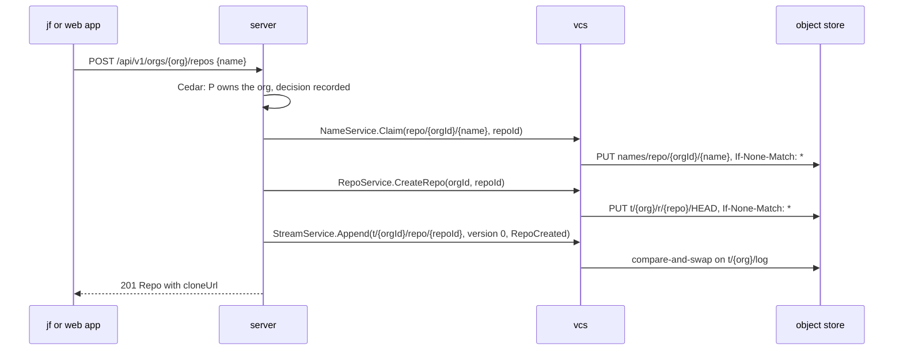
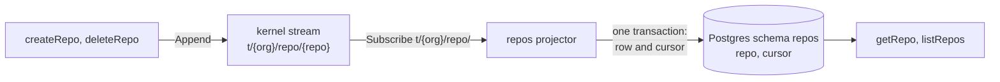

# Orgs and repos

The repositories of [#23](https://github.com/nca-apprentices/jjforge/issues/23).
The server's `repos` module owns the stream prefix `t/{org}/repo/` and the
Postgres schema `repos`, as [ADR 0005](../adr/0005-storage-kernel.md) decides.
The organization requirement, [#24](https://github.com/nca-apprentices/jjforge/issues/24),
gets its section in its own spec PR.

The scenarios use the seed that `mise run up` loads once
[#6](https://github.com/nca-apprentices/jjforge/issues/6) and
[#13](https://github.com/nca-apprentices/jjforge/issues/13) are built: an owner and a member of the organization `acme`, and an owner of
`other`, as [ADR 0018](../adr/0018-external-systems-run-as-twins.md) decides.

## Create a repository (#25)

An owner adds an empty repository to their organization, and members use it at
once. The answer carries the clone address
`https://{host}/sync/v1/{orgId}/{repoId}`, and the sync head answers before
any read model has caught up. A member's attempt is refused with 403
`forbidden`, as [#15](https://github.com/nca-apprentices/jjforge/issues/15)
decides. Operation `createRepo`, command `jf repo create`, and the New
repository screen.

Scenario: [repo-create.hurl](../../e2e/http/pending/repo-create.hurl).

## A repository name is unique within its organization (#26)

Two repositories in one organization never share a name. A second one with the
same name is refused with 409 `name_taken`. The same name in another
organization is a different name and succeeds. Part of `createRepo`.

Scenario: [repo-name-unique.hurl](../../e2e/http/pending/repo-name-unique.hurl).

## A person sees only the organizations and repositories they belong to (#27)

Lists show only the person's organizations and their repositories. An
organization or a repository the person doesn't belong to answers 404
`not_found`, never 403, so an outsider learns nothing from the answer.
Operations: `listOrgs`, `getOrg`, `listRepos`, `getRepo`.

Scenario: [repo-visibility.hurl](../../e2e/http/pending/repo-visibility.hurl).

## Delete a repository (#28)

An owner removes a repository and everything in it. Afterwards it can't be
read, cloned, or pushed to, and its name is free for a new repository. A
member's attempt is refused with 403 `forbidden`, as
[#15](https://github.com/nca-apprentices/jjforge/issues/15) decides.
Operation: `deleteRepo`. Command: `jf repo delete`.

Scenario: [repo-delete.hurl](../../e2e/http/pending/repo-delete.hurl).

## Flow

### Create a repository

Command `createRepo(org, name)` by principal P, served by `POST
/api/v1/orgs/{org}/repos`.



1. Policy: P is an owner of the organization, decided by Cedar and recorded,
   as [ADR 0004](../adr/0004-identity-and-tokens.md) decides. Refused: 403
   `forbidden`.
2. Name: `NameService.Claim("repo/{orgId}/{name}", owner = repoId)`, with a
   new UUIDv7 as the repository ID. `ALREADY_EXISTS`: 409 `name_taken`. The
   claim is global, so the same name in another organization is a different
   name.
3. Storage: `RepoService.CreateRepo(orgId, repoId)`. vcs writes
   `t/{org}/r/{repo}/HEAD` at the root operation with `If-None-Match: *`, as
   [ADR 0006](../adr/0006-object-store-is-the-source-of-truth.md) decides.
   This step runs in the command, not in a projector, because the repository
   can be cloned right away.
4. Stream: append `repos.v1.RepoCreated` to `t/{orgId}/repo/{repoId}` with
   expected version 0. The principal comes from the token, in
   `Event.principal_id`, never from the event body.
5. Answer 201 from the command's own values, with the clone address
   `https://{host}/sync/v1/{orgId}/{repoId}`. Nothing waits on the read
   model.

### Delete a repository

Command `deleteRepo(org, repo)` by principal P, served by `DELETE
/api/v1/orgs/{org}/repos/{repo}`.

1. Policy: P is an owner of the organization. Refused: 403 `forbidden`. A
   principal outside the organization gets 404 `not_found`, as every read
   does.
2. Stream: append `repos.v1.RepoDeleted` with the version the command read. A
   stream that moved answers `ABORTED`, and the command reloads and tries
   again. A repository that is already deleted answers 404.
3. Storage: `RepoService.DeleteRepo(orgId, repoId)` removes everything under
   `t/{org}/r/{repo}/`. Objects in the organization's pool that nothing
   references any more are collected by the background job of ADR 0006.
4. Name: `NameService.ReleaseName("repo/{orgId}/{name}", owner = repoId)`, so
   the name is free for a new repository.
5. Answer 204.

## Persistence

The stream `t/{orgId}/repo/{repoId}` holds `repos.v1.RepoCreated` and
`repos.v1.RepoDeleted`, defined in
[proto/repos/v1](../../proto/repos/v1/). The object store holds the claimed
name at `names/repo/{orgId}/{name}` and the repository at
`t/{org}/r/{repo}/`, starting with its `HEAD`.

The read model is the Postgres schema `repos`, written only by the projector:



```text
repo(org_id, id, name, clone_url, created_at)   primary key (org_id, id)
                                                 unique (org_id, name)
cursor(projector, position)
```

The projector applies `RepoCreated` as an insert and `RepoDeleted` as a
delete, and writes its cursor in the same transaction, as
[ADR 0008](../adr/0008-postgres-holds-read-models.md) decides.

`getRepo` and `listRepos` read it. `listRepos` orders by `(org_id, id)`, so
the list is in creation order, and the `next` cursor encodes the last ID. The
policy decides visibility per request, and a denied read answers 404
`not_found`, never 403.

## Architecture

- The server's `repos` module: the controller that overrides the generated
  methods, as [ADR 0011](../adr/0011-controllers-implement-contracts.md)
  decides, the commands, and the projector.
- vcs, over gRPC: `NameService` for the claimed names, `RepoService` for the
  repository's objects, and `StreamService` for the events, as
  [ADR 0005](../adr/0005-storage-kernel.md) decides.
- Cedar in the server decides the policy and records each decision, as
  [ADR 0004](../adr/0004-identity-and-tokens.md) decides.
- External systems and their twins in `shared/deploy/compose.yaml`: Postgres
  as `postgres`, the object store as `seaweedfs`, and the identity provider
  that issues the scenarios' tokens as `oidc`.

## Failures

A crash after the name is claimed leaves a claimed name with no stream. The
sweeper that holds the lease `repos/sweeper` releases a claim whose owner has
no `RepoCreated` after ten minutes.

A crash after the `HEAD` is written leaves a `HEAD` with no event. The same
sweeper deletes it. The storage and stream steps are idempotent for one
repository ID, so the server may retry them.

On delete, the event comes first, so a crash after it leaves a deleted
repository whose storage and name the sweeper cleans up. A crash before it
leaves nothing.
