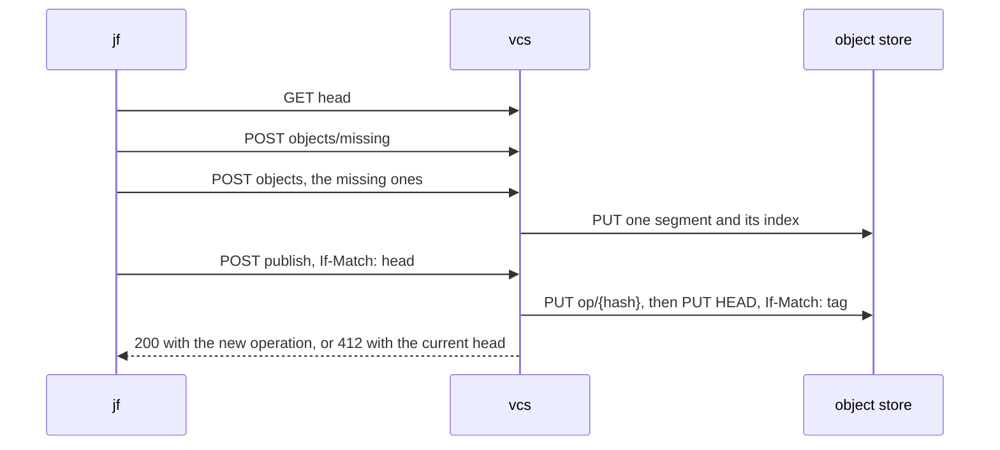

# Push and clone

The native sync of [#29](https://github.com/nca-apprentices/jjforge/issues/29).
vcs owns it, and `jf` speaks it over `sync/v1`, as
[ADR 0001](../adr/0001-native-jj-without-git.md) decides. The repository
lives in the object store, as
[ADR 0002](../adr/0002-state-boundaries-and-tokens.md) decides.

Each open question at the end of this page names the issue of the spike
[#62](https://github.com/nca-apprentices/jjforge/issues/62) that answers it.
No requirement on this page is built until that section is gone.

The scenarios create their repositories through the REST API of
[#23](https://github.com/nca-apprentices/jjforge/issues/23), and sign in as
the people of its seed.

## Clone a repository (#30)

[#30](https://github.com/nca-apprentices/jjforge/issues/30) states the
requirement.

| ID   | Functional requirement                                                                                                                                  |
| ---- | ------------------------------------------------------------------------------------------------------------------------------------------------------- |
| 30.1 | `jf clone <address> <dir>` creates a workspace with the store type `jjforge` and records the forge as the remote `forge`.                               |
| 30.2 | The clone's operation log holds every operation from the root to the forge's `HEAD`, under the same operation IDs.                                      |
| 30.3 | Each commit in the clone has the same commit ID, change ID, and tree terms as on the forge, because both hold the same `store.v1` bytes.                |
| 30.4 | The working copy starts a new change on `main@forge`, or on the root commit when `main` is absent.                                                      |
| 30.5 | A principal who can't read the repository gets 404 `not_found`, `jf` exits with 4, and no directory is left behind.                                     |

- Operations: `GET {base}/head`, `GET {base}/operations?since=`, and
  `POST {base}/objects/fetch`.
- Types: `sync.v1.Head`, `sync.v1.ObjectBundle`, `store.v1.Operation`,
  `store.v1.View`, `store.v1.Commit`, jj-lib's `Workspace` and
  `RepoLoader`, and the store crate's `Fetch`.
- Flow: [clone and fetch](#clone-and-fetch).

Scenario: [30-repo-clone.bats](../../e2e/cli/30-repo-clone.bats).

## Push a jj repository (#31)

[#31](https://github.com/nca-apprentices/jjforge/issues/31) states the
requirement.

| ID   | Functional requirement                                                                                                 |
| ---- | ---------------------------------------------------------------------------------------------------------------------- |
| 31.1 | `jf push --bookmark <name>` publishes each named bookmark and uploads every object it reaches that vcs lacks.          |
| 31.2 | A pushed commit keeps its commit ID, because `jf` stores it in the `store.v1` encoding that vcs stores.                |
| 31.3 | A conflicted commit keeps every term of its `TreeMerge` and its `conflict_labels`.                                     |
| 31.4 | The publish carries the predecessors of each pushed commit, and vcs writes them into `Operation.commit_predecessors`.  |
| 31.5 | After a publish, `jf` sets `<name>@forge` to the pushed target.                                                        |
| 31.6 | vcs refuses a malformed object with 400 `invalid`, and an object whose BLAKE3 hash differs from its name the same way. |

- Operations: `GET {base}/head`, `POST {base}/objects/missing`,
  `POST {base}/objects`, and `POST {base}/publish`.
- Types: `sync.v1.HashList`, `sync.v1.ObjectBundle`,
  `sync.v1.PublishRequest`, `sync.v1.BookmarkUpdate`,
  `sync.v1.PublishResponse`, `store.v1.StoredObject`, and the store crate's
  `Repo`.
- Flow: [push](#push).

Scenario: [31-repo-push.bats](../../e2e/cli/31-repo-push.bats).

## A pushed bookmark is visible at once (#32)

[#32](https://github.com/nca-apprentices/jjforge/issues/32) states the
requirement.

| ID   | Functional requirement                                                                                                  |
| ---- | ----------------------------------------------------------------------------------------------------------------------- |
| 32.1 | vcs answers a publish with 200 only after the object store has accepted the new `HEAD`.                                 |
| 32.2 | `GET {base}/head` reads `HEAD` from the object store on every request. No replica caches it.                            |
| 32.3 | A replica caches only immutable answers: objects, operations, and views by their ID.                                    |
| 32.4 | A publish completes within the p99 latency that [#110](https://github.com/nca-apprentices/jjforge/issues/110) measures. |

- Operations: `POST {base}/publish` and `GET {base}/head`.
- Types: `sync.v1.Head` and the store crate's `Repo`.
- Flow: [push](#push).

Scenario: [32-push-visible.bats](../../e2e/cli/32-push-visible.bats).

## A rejected push changes nothing (#33)

[#33](https://github.com/nca-apprentices/jjforge/issues/33) states the
requirement.

| ID   | Functional requirement                                                                                           |
| ---- | ---------------------------------------------------------------------------------------------------------------- |
| 33.1 | vcs checks every `BookmarkUpdate` of a publish before it writes anything. One refusal refuses the whole publish. |
| 33.2 | A bookmark whose `old_target` differs from the current view refuses the publish with 412 `precondition_failed`.  |
| 33.3 | A refused publish writes no operation and no view, and leaves `HEAD` where it was.                               |
| 33.4 | A principal outside the organization gets 404 `not_found`, and one without write scope 403 `forbidden`.          |

- Operations: `POST {base}/publish`.
- Types: `sync.v1.PublishRequest`, `sync.v1.BookmarkUpdate`,
  `store.v1.RefTarget`, and the store crate's `Repo`.
- Flow: [push](#push), from step 1 to step 3.

Scenario: [33-push-atomic.bats](../../e2e/cli/33-push-atomic.bats).

## Import an existing jj repository (#88)

[#88](https://github.com/nca-apprentices/jjforge/issues/88) states the
requirement.

| ID   | Functional requirement                                                                                            |
| ---- | ----------------------------------------------------------------------------------------------------------------- |
| 88.1 | `jf import <path> <address>` opens the repository at the path with jj-lib's default store factories, without git. |
| 88.2 | It writes each commit as a `store.v1.Commit`, parents first. Each keeps its change ID and gets a new commit ID.   |
| 88.3 | It records each old commit ID and its new one in `.jj/repo/jjforge-import` of the source repository.              |
| 88.4 | It publishes the source's bookmarks in one operation.                                                             |
| 88.5 | A second import converts and uploads only the commits that the record lacks.                                      |

- Operations: the operations of a push.
- Types: jj-lib's `Backend::read_commit` and `CommitBuilder`, and
  `store.v1.Commit`.
- Flow: [import](#import).

Scenario: [88-repo-import.bats](../../e2e/cli/88-repo-import.bats).

## Two pushes at once lose nothing (#89)

[#89](https://github.com/nca-apprentices/jjforge/issues/89) states the
requirement.

| ID   | Functional requirement                                                                                                                          |
| ---- | ----------------------------------------------------------------------------------------------------------------------------------------------- |
| 89.1 | A publish whose `If-Match` names a stale head gets 412 `precondition_failed` with the current `Head`, and vcs writes nothing.                   |
| 89.2 | On 412, `jf` fetches, merges with `RepoLoader::merge_operations`, and publishes again against the new head.                                     |
| 89.3 | Two publishes that change different bookmarks both land.                                                                                        |
| 89.4 | When the merge leaves a pushed bookmark conflicted, `jf` stops, reports the conflict, and exits with 6.                                         |
| 89.5 | `jf` retries at most as often, and vcs answers within the latency, that [#110](https://github.com/nca-apprentices/jjforge/issues/110) measures. |

- Operations: `POST {base}/publish` and the operations of a fetch.
- Types: `sync.v1.Head`, `sync.v1.PublishRequest`, and the store crate's
  `Repo` and `Published`.
- Flow: [push](#push), step 5.

Scenario: [89-concurrent-push.bats](../../e2e/cli/89-concurrent-push.bats).

## A large clone is usable at once (#90)

[#90](https://github.com/nca-apprentices/jjforge/issues/90) states the
requirement.

| ID   | Functional requirement                                                                                                                                                 |
| ---- | ---------------------------------------------------------------------------------------------------------------------------------------------------------------------- |
| 90.1 | A clone fetches the operations, the views, and the commits they reach, and no tree or file.                                                                            |
| 90.2 | `Backend::read_tree` and `Backend::read_file` fetch a missing object with `POST {base}/objects/fetch`, bundled with its siblings.                                      |
| 90.3 | A fetched object stays in the local store and is never fetched again.                                                                                                  |
| 90.4 | `jf log`, `jf op log`, `jf evolog`, and every other history command read no tree or file.                                                                              |
| 90.5 | A checkout fetches only the trees and files of the commit it checks out, within the limit that [#109](https://github.com/nca-apprentices/jjforge/issues/109) measures. |

- Operations: `POST {base}/objects/fetch`.
- Types: `sync.v1.HashList`, `sync.v1.ObjectBundle`, and the store
  crate's `Fetch` and `Backend`.
- Flow: [clone and fetch](#clone-and-fetch), step 4.

Scenario: [90-lazy-clone.bats](../../e2e/cli/90-lazy-clone.bats).

## A pushed repository survives a restart (#97)

[#97](https://github.com/nca-apprentices/jjforge/issues/97) states the
requirement.

| ID   | Functional requirement                                                                    |
| ---- | ----------------------------------------------------------------------------------------- |
| 97.1 | vcs keeps no state between requests except caches of immutable objects.                   |
| 97.2 | Every write reaches the object store before vcs answers it.                               |
| 97.3 | After every service restarts, `HEAD` and every object read back from the object store.    |

- Operations: every operation of a push and a clone.
- Types: the store crate's `Repo`.
- Flow: [push](#push), step 4.

Scenario: [97-survives-restart.bats](../../e2e/cli/97-survives-restart.bats).

## Fetch into an existing clone (#101)

[#101](https://github.com/nca-apprentices/jjforge/issues/101) states the
requirement.

| ID    | Functional requirement                                                                                                            |
| ----- | --------------------------------------------------------------------------------------------------------------------------------- |
| 101.1 | `jf fetch` reads `GET {base}/head` and changes nothing when the head equals the last operation it fetched.                        |
| 101.2 | Otherwise it fetches the operations since that one, merges them into its own, and sets each `<name>@forge` to the forge's target. |
| 101.3 | A rewritten change shows its new commit under the same change ID, and the old commit is hidden, as `commit_predecessors` records. |

- Operations: `GET {base}/head` and `GET {base}/operations?since=`.
- Types: `sync.v1.Head`, `sync.v1.ObjectBundle`, `store.v1.View` with its
  `remote_views["forge"]`, and jj-lib's `RepoLoader`.
- Flow: [clone and fetch](#clone-and-fetch), from step 2 to step 3.

Scenario: [101-repo-fetch.bats](../../e2e/cli/101-repo-fetch.bats).

## Each operation names who made it (#102)

[#102](https://github.com/nca-apprentices/jjforge/issues/102) states the
requirement.

| ID    | Functional requirement                                                                                                            |
| ----- | --------------------------------------------------------------------------------------------------------------------------------- |
| 102.1 | vcs sets `Operation.username` to the token's subject and `Operation.hostname` to `jjforge`.                                       |
| 102.2 | vcs records the delegation chain in `Operation.attributes` under `jjforge.delegation`, as subjects from the outermost actor in.   |
| 102.3 | vcs sets the start and end time from its own clock. `PublishRequest` carries no name and no time, so a client can't claim either. |

- Operations: `POST {base}/publish`.
- Types: `store.v1.Operation`, and the store crate's `Author`, which vcs
  builds from the verified token.
- Flow: [push](#push), step 4.

Scenario: [102-operation-author.bats](../../e2e/cli/102-operation-author.bats).

## A clone shows how each change evolved (#103)

[#103](https://github.com/nca-apprentices/jjforge/issues/103) states the
requirement.

| ID    | Functional requirement                                                                                                              |
| ----- | ----------------------------------------------------------------------------------------------------------------------------------- |
| 103.1 | `PublishRequest.commit_predecessors` maps each pushed commit, and each of its local predecessors in turn, to its predecessors.      |
| 103.2 | `jf` uploads every predecessor commit that vcs lacks, but not its trees or files.                                                   |
| 103.3 | `jf evolog` in a clone lists every version of a change, newest first.                                                               |

- Operations: `POST {base}/objects` and `POST {base}/publish`.
- Types: `sync.v1.PublishRequest`, `store.v1.CommitIds`, and
  `store.v1.Operation`.
- Flow: [push](#push), step 2.

Scenario: [103-change-history.bats](../../e2e/cli/103-change-history.bats).

## Out of scope

- Reading a repository that git backs. `jf` has no git in it, as
  [ADR 0001](../adr/0001-native-jj-without-git.md) decides, so an import
  reads only a repository on jj's own backend until
  [#120](https://github.com/nca-apprentices/jjforge/issues/120) answers how
  to import one that git backs.
- Protected bookmarks and the landing token, which the review epic
  specifies.
- Collecting unreachable objects. Nothing is collected, as
  [ADR 0002](../adr/0002-state-boundaries-and-tokens.md) decides.

## Flow

### Push

Operation `publish` by principal P, from `jf push`.



1. Token: vcs verifies the JWT offline. Refused: 401 `unauthenticated`. A
   principal outside the organization gets 404 `not_found`.
2. Objects: `jf` walks the commits that the pushed bookmarks reach and asks
   which objects vcs lacks. vcs hashes every uploaded object and refuses a
   malformed one: 400 `invalid`. It writes the upload as one segment with
   its index.
3. Publish: vcs checks that every referenced object is present and that the
   token's scope covers each changed bookmark. Refused: 403 `forbidden`.
4. Operation: vcs builds the operation from the request. P and the
   delegation chain come from the token, and the time from vcs's clock. vcs
   writes the operation and its view, then moves `HEAD` with `If-Match`.
5. Race: on 412 `precondition_failed`, `jf` fetches, merges the operations
   with `RepoLoader::merge_operations`, and publishes again.
6. Local view: `jf` records each pushed bookmark as the remote bookmark
   `<name>@forge`, so `jf log` shows what the forge holds.

### Clone and fetch

1. `jf clone` creates the workspace with `Workspace::init_with_factories`
   and the store type `jjforge`.
2. `jf` reads `head`, then `operations?since=` its last operation, and
   writes the operations and views to its local op store.
3. `jf` merges the fetched operation into its own with
   `RepoLoader::merge_operations`, and records the forge's bookmarks under
   the remote `forge`.
4. The working copy reads trees and files through the backend. A read that
   misses the local cache fetches a bundle from vcs, as
   [ADR 0001](../adr/0001-native-jj-without-git.md) decides.

### Import

`jf import` opens the local repository through jj-lib's factories, reads
each commit with `Backend::read_commit`, writes it in the store format with
the same change ID, and pushes the result as one operation.

## Persistence

The object store holds each repository at `t/{org}/r/{repo}/`, as
[ADR 0002](../adr/0002-state-boundaries-and-tokens.md) decides:

```text
pool/seg/{segment}   packed objects
pool/idx/{segment}   hash to segment and offset, read by range
op/{hash}            operations and views
HEAD                 the current operation
```

A push touches no Postgres table. A clone keeps the same objects under
`.jj/repo/store/` with the store type `jjforge`, and the forge's head as its
last fetched operation.

## Architecture

The paths cross three crates. Each crate exposes only the items below, and
keeps the rest in private modules, as
[ADR 0003](../adr/0003-checked-code-rules.md) decides.

| Crate | Item                     | Kind        | Role                                                                                                                          |
| ----- | ------------------------ | ----------- | ----------------------------------------------------------------------------------------------------------------------------- |
| store | `factories()`            | function    | Returns the jj-lib `StoreFactories` that register the store type `jjforge`.                                                   |
| store | `ObjectId`               | struct      | The 32-byte BLAKE3 hash of an encoded `store.v1.StoredObject`.                                                                |
| store | `Repo`                   | struct      | One repository in the object store, opened from a URL, an organization ID, and a repository ID. vcs calls it for every route. |
| store | `Repo::create`           | method      | Writes `HEAD` at the root operation with `If-None-Match: *`, for [#25](https://github.com/nca-apprentices/jjforge/issues/25). |
| store | `Repo::delete`           | method      | Removes everything under the repository's prefix, for [#28](https://github.com/nca-apprentices/jjforge/issues/28).            |
| store | `Repo::head`             | method      | Reads `HEAD` and its entity tag.                                                                                              |
| store | `Repo::missing`          | method      | Answers which of a list of IDs the repository lacks.                                                                          |
| store | `Repo::put`              | method      | Verifies and writes an `ObjectBundle` as one segment with its index.                                                          |
| store | `Repo::fetch`            | method      | Reads objects by ID, from the index by range.                                                                                 |
| store | `Repo::operations_since` | method      | Reads the operations and views after an operation.                                                                            |
| store | `Repo::publish`          | method      | Checks a `PublishRequest`, writes the operation and its view, and moves `HEAD` by compare-and-swap.                           |
| store | `Published`              | enumeration | `Moved(OperationId)`, or `Stale(Head)` when the entity tag no longer matches.                                                 |
| store | `Author`                 | struct      | The subject and the delegation chain that go into the operation's metadata.                                                   |
| store | `Fetch`                  | trait       | Fetches missing objects for `Backend` reads. `jf` implements it over `sync/v1`.                                               |
| vcs   | `sync`                   | module      | The `sync/v1` routes over HTTP, each calling `Repo`.                                                                          |
| vcs   | `auth`                   | module      | Verifies the JWT against the published key set and builds an `Author`.                                                        |
| `jf`  | `commands`               | module      | `clone`, `fetch`, `push`, and `import`, added to jj-cli.                                                                      |
| `jf`  | `forge`                  | module      | `SyncClient`, the `sync/v1` client, which implements `Fetch`.                                                                 |

External systems and their twins in `shared/deploy/compose.yaml`: the object
store as `seaweedfs`, and the identity provider as `oidc`.

## Libraries

### jj-lib and jj-cli 0.45.1

Both are pinned to `=0.45.1` and built without git or watchman, as
[ADR 0001](../adr/0001-native-jj-without-git.md) decides. Only `jf` and the
store crate depend on them, as
[ADR 0003](../adr/0003-checked-code-rules.md) decides.

The store crate implements three traits and registers them under the store
type `jjforge` with `StoreFactories::add_backend`, `add_op_store`, and
`add_op_heads_store`. `jf` passes them to `CliRunner::add_store_factories`.

| Trait          | Methods jjforge implements                                                                                                                      | Over                                                |
| -------------- | ----------------------------------------------------------------------------------------------------------------------------------------------- | --------------------------------------------------- |
| `Backend`      | `read_file`, `write_file`, `read_symlink`, `write_symlink`, `read_copy`, `write_copy`, `read_tree`, `write_tree`, `read_commit`, `write_commit` | `store.v1` objects named by BLAKE3                  |
| `OpStore`      | `read_view`, `write_view`, `read_operation`, `write_operation`, `resolve_operation_id_prefix`                                                   | `op/{hash}`                                         |
| `OpHeadsStore` | `get_op_heads`, `update_op_heads`, `lock`                                                                                                       | `HEAD` with `If-Match` in vcs, a local file in `jf` |

jjforge maps these jj-lib types onto `store.v1`:

| jj-lib type                   | Fields                                                                                                                     | `store.v1`                     |
| ----------------------------- | -------------------------------------------------------------------------------------------------------------------------- | ------------------------------ |
| `backend::Commit`             | `parents`, `predecessors`, `root_tree`, `conflict_labels`, `change_id`, `description`, `author`, `committer`, `secure_sig` | `Commit`                       |
| `backend::Tree`, `TreeValue`  | entries by name, each a file, a symbolic link, a tree, or a conflict                                                       | `Tree`, `TreeEntry`, `FileRef` |
| `MergedTree`                  | a merge of tree IDs, which is how a commit holds a conflict                                                                | `TreeMerge`                    |
| `backend::CopyHistory`        | `current_path`, `parents`                                                                                                  | none yet, an open question     |
| `op_store::Operation`         | `view_id`, `parents`, `metadata`, `commit_predecessors`                                                                    | `Operation`                    |
| `op_store::OperationMetadata` | `time`, `description`, `hostname`, `username`, `is_snapshot`, `workspace_name`, `attributes`                               | `Operation`                    |
| `op_store::View`              | `head_ids`, `local_bookmarks`, `local_tags`, `remote_views`, `wc_commit_ids`                                               | `View`                         |

jjforge leaves these parts of jj-lib unused:

- `View::git_refs` and `View::git_heads`, the git backend, and the secret
  backend.
- `Backend::gc` and `OpStore::gc`, which do nothing, because nothing is
  collected.
- The index store and the working copy, which stay jj-lib's defaults:
  `DefaultIndexStore` builds its index locally from the commits, and
  `LocalWorkingCopy` checks out files on disk.

jj-lib's `OpHeadsStore` keeps a set of heads and merges divergent ones when
it loads them with `op_heads_store::resolve_op_heads`. The forge keeps one
`HEAD`, so `update_op_heads` in vcs never leaves two heads behind.

## Security

- vcs trusts only the token's signature, checked against the server's
  published key set. It ignores every name the client sends, so an
  operation names the principal from the token.
- vcs verifies the hash of every uploaded object and decodes it before it
  stores it, so a client can't store bytes under another object's name.
- A publish references only objects the store already holds, so a
  repository can't point at another repository's objects.
- An upload has a size limit, and a bundle a count limit, both answered with
  413 before vcs reads the body. The limits come from the measurement of
  [#110](https://github.com/nca-apprentices/jjforge/issues/110).

## Failures

A crash after a segment is written and before `HEAD` moves leaves a segment
that no operation names. Nobody reads it, and it costs storage only.

A crash after the operation is written and before `HEAD` moves leaves an
operation that `HEAD` doesn't reach. The client gets no answer and publishes
again, which writes a new operation. The old one stays unreachable.

A push that loses every retry reports the conflict, and its objects stay in
the store for the next push.

## Tests

- The store crate passes jj-lib's tests for a backend and an op store,
  ported to the `jjforge` store type, because jj-lib publishes no
  conformance tests, as
  [ADR 0001](../adr/0001-native-jj-without-git.md) decides.
- A round trip of each jj-lib type in the Libraries table through
  `store.v1` returns an equal value.
- An integration test publishes to SeaweedFS from several writers at once
  and checks that the operation log holds every publish.

## Open questions

- How `jf`'s local op heads map onto the forge's one `HEAD`, and whether vcs
  builds an operation with a jj-lib `Transaction` or edits the view itself.
  [#106](https://github.com/nca-apprentices/jjforge/issues/106) answers it.
- How `store.v1` stores a `CopyHistory`.
  [#105](https://github.com/nca-apprentices/jjforge/issues/105) answers it.
- The segment and index format, and the bundle size of a lazy read.
  [#109](https://github.com/nca-apprentices/jjforge/issues/109) answers it.
- The limits on push latency, retries, and upload size.
  [#110](https://github.com/nca-apprentices/jjforge/issues/110) answers it.
- How a person imports a repository that git backs, since `jf` has no git.
  [#120](https://github.com/nca-apprentices/jjforge/issues/120) answers it.
