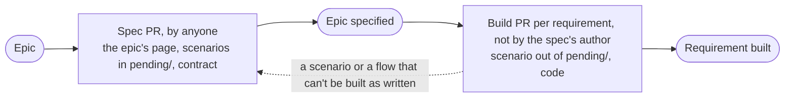

# Workflow

Work is planned in GitHub issues and the
[jjforge Project](https://github.com/orgs/nca-apprentices/projects/1). Status
lives in issues, and durable content lives in the repository. An issue holds
no design text beyond its statement. The spec page of its epic, in
[specs/](specs/README.md), holds the rest.

## Issues

| Type        | Answers                                      | Done when                                                                        |
| ----------- | -------------------------------------------- | -------------------------------------------------------------------------------- |
| Epic        | What can be demonstrated when it is done     | Demo shown and exit criteria hold                                                |
| Requirement | What must be true, tested from the outside   | Its build PR merged with `Closes #n`, so its scenario left `pending/` and passes |

The other types are Task and Bug. A task is engineering work that no
requirement states, such as moving the web app into its own image. A
requirement or a task is a sub-issue of its epic. The issue forms set the
type.

A [milestone](https://github.com/nca-apprentices/jjforge/milestones) is a
state of the forge, defined in its description. An epic or a task carries one
once it is planned. A requirement carries none, because its epic's covers it.

## Rules

1. **A requirement names no interface.** It says what a person can do and how
   that is tested. It never names an endpoint, a command, or a technology.
   Limits such as latency or size are allowed.
2. **An epic is specified before its requirements are built**, as
   [ADR 0004](adr/0004-specified-tested-built.md) decides. One spec PR writes
   the epic's page in [specs/](specs/README.md), with a section per
   requirement.
   [Specifying and building](#specifying-and-building) lists the steps.
3. **The issue number is the reference.** A spec section, a build PR, and a
   commit cite `#35`. A title holds no ID, because the number and the type
   already identify the issue.

## Specifying and building

One spec PR specifies a whole epic in its page under
[specs/](specs/README.md). Then one build PR per requirement builds it, as
[ADR 0004](adr/0004-specified-tested-built.md) decides:

| PR    | Covers                              | Title                                    | Body                                     |
| ----- | ----------------------------------- | ---------------------------------------- | ---------------------------------------- |
| Spec  | an epic, with every requirement     | `spec: <what people can do>`             | `Part of #<epic>`                        |
| Build | one requirement                     | `feat(<module>): <what a person can do>` | `Closes #<n>` and what the checks showed |

In a spec PR:

1. Write the epic's page with a section for every requirement, in the format
   the specs README gives, and add its row there.
2. Write each scenario in `shared/e2e/http/pending/` or
   `shared/e2e/cli/pending/`. It uses concrete values and checks the problem
   code of every refusal. Link it from its section.
3. Change `shared/api/` and `shared/proto/` until every assert is
   expressible.
4. Run `mise run lint` and `mise run api:breaking`.

In a build PR:

1. Move the scenario out of `pending/` and update its link. Start
   `mise run up`, and watch `mise run e2e` fail.
2. Build along the Flow section. A controller overrides the generated method,
   as [ADR 0003](adr/0003-checked-code-rules.md) decides. Nothing else in the
   spec changes.
3. Run `mise run test`, `mise run lint`, and `mise run e2e`. Check that
   `mise run compose logs` shows no error and that the state the Persistence
   section names exists.

CI adds three checks:

- The Spec workflow fails a build PR whose `Closes #<n>` names a requirement
  that no spec page on the base branch has a section for.
- It fails a breaking REST change, because a version changes only by
  addition, as [ADR 0001](adr/0001-native-jj-without-git.md) decides.
- `buf breaking` guards every proto against `main`, because the server, vcs,
  and `jf` run different versions during a rolling deploy and long after it.

## Tracking

The only label is `good first issue`, which GitHub lists on the repository's
contribute page. It marks a task or a requirement with clear steps and a
small scope.

The Project tracks each issue's status. An epic's start and target dates
place it on the Project's roadmap, and its milestone's due date bounds them.
